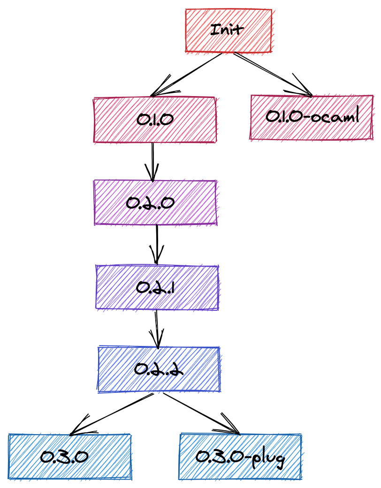

# Vim Configuration from Minimal to Complete

From a configuration that works on low-resource, restricted permissions environments, to a complete configuration...  
And from almost scratch. Because I like to know what's in my `.vimrc`.

__TL;DR the final vimrc and at the different steps is in [this repository](https://github.com/ThomasMarcel/vimrc), with tags for each step.__

_Vim rocks 🤘! And recent plugins can make it really great for coding, most notably using [Conquer of Completion](https://github.com/neoclide/coc.nvim) with NodeJS, that has a bunch of extensions for a lot of languages using the Language Server Protocol._

_In this article however, we'll assume to be working on a low resource computer, or limited in what can be installed, runtimes available, etc. So code completion, linting, quality without external runtimes!_

I'll use [this GitHub repository](https://github.com/ThomasMarcel/vimrc) and tags for each steps in ths article.

- [Vim Configuration from Minimal to Complete](#vim-configuration-from-minimal-to-complete)
- [Minimal Configuration](#minimal-configuration)
- [Adding Plugins](#adding-plugins)
  - [Plugin Initialization](#plugin-initialization)
    - [Vim Packages](#vim-packages)
    - [Vim-Plug](#vim-plug)
  - [General Developer Experience (DX) Plugins](#general-developer-experience-dx-plugins)
    - [Vim Packages](#vim-packages-1)
    - [Vim-Plug](#vim-plug-1)
  - [Linter and Fixer](#linter-and-fixer)
    - [Vim Packages](#vim-packages-2)
    - [Vim-Plug](#vim-plug-2)
  - [Language-specific configuration and plugins](#language-specific-configuration-and-plugins)
    - [Linting configuration](#linting-configuration)
    - [Language plugins](#language-plugins)
  - [Colors and Themes](#colors-and-themes)
    - [Vim Packages](#vim-packages-3)
    - [Vim-Plug](#vim-plug-3)
  - [Extras](#extras)
    - [Authoring](#authoring)
  - [More](#more)
    - [Plugins](#plugins)
    - [Dotfiles and vimrc generators](#dotfiles-and-vimrc-generators)
- [Conclusion](#conclusion)

__You can apply the diffs in this post by copying them in a file, let's say `example.patch`, and apply them, as long as you have the same directory structure as in my GitHub repository, and run `$ git apply example.patch`.__

# Minimal Configuration

Let's create a minimal vimrc file with some basic configuration we need.

-  As a base, we'll take the content of Tim Pope's [vim-sensible plugin](https://github.com/tpope/vim-sensible)
    - Now we have in [tag 0.1.0](https://github.com/ThomasMarcel/vimrc/blob/0.1.0/.vimrc) our minimal vimrc as recommended

    ```
    " sensible.vim - Defaults everyone can agree on
    " Maintainer:   Tim Pope <http://tpo.pe/>
    " Version:      1.2

    if exists('g:loaded_sensible') || &compatible
    finish
    else
    let g:loaded_sensible = 'yes'
    endif

    if has('autocmd')
    filetype plugin indent on
    endif
    if has('syntax') && !exists('g:syntax_on')
    syntax enable
    endif

    " Use :help 'option' to see the documentation for the given option.

    set autoindent
    set backspace=indent,eol,start
    set complete-=i
    set smarttab

    set nrformats-=octal

    if !has('nvim') && &ttimeoutlen == -1
    set ttimeout
    set ttimeoutlen=100
    endif

    set incsearch
    " Use <C-L> to clear the highlighting of :set hlsearch.
    if maparg('<C-L>', 'n') ==# ''
    nnoremap <silent> <C-L> :nohlsearch<C-R>=has('diff')?'<Bar>diffupdate':''<CR><CR><C-L>
    endif

    set laststatus=2
    set ruler
    set wildmenu

    if !&scrolloff
    set scrolloff=1
    endif
    if !&sidescrolloff
    set sidescrolloff=5
    endif
    set display+=lastline

    if &encoding ==# 'latin1' && has('gui_running')
    set encoding=utf-8
    endif

    if &listchars ==# 'eol:$'
    set listchars=tab:>\ ,trail:-,extends:>,precedes:<,nbsp:+
    endif

    if v:version > 703 || v:version == 703 && has("patch541")
    set formatoptions+=j " Delete comment character when joining commented lines
    endif

    if has('path_extra')
    setglobal tags-=./tags tags-=./tags; tags^=./tags;
    endif

    if &shell =~# 'fish$' && (v:version < 704 || v:version == 704 && !has('patch276'))
    set shell=/usr/bin/env\ bash
    endif

    set autoread

    if &history < 1000
    set history=1000
    endif
    if &tabpagemax < 50
    set tabpagemax=50
    endif
    if !empty(&viminfo)
    set viminfo^=!
    endif
    set sessionoptions-=options
    set viewoptions-=options

    " Allow color schemes to do bright colors without forcing bold.
    if &t_Co == 8 && $TERM !~# '^Eterm'
    set t_Co=16
    endif

    " Load matchit.vim, but only if the user hasn't installed a newer version.
    if !exists('g:loaded_matchit') && findfile('plugin/matchit.vim', &rtp) ==# ''
    runtime! macros/matchit.vim
    endif

    if empty(mapcheck('<C-U>', 'i'))
    inoremap <C-U> <C-G>u<C-U>
    endif
    if empty(mapcheck('<C-W>', 'i'))
    inoremap <C-W> <C-G>u<C-W>
    endif

    " vim:set ft=vim et sw=2:
    ```

    - Note that we could have used this plugin as explained in the installation. But
      1. it makes for a great base
      1. We're trying to use the less possible plugins at the beginning, then build upon it
    - _Anecdote: the toolkit for ocaml developers does that same thing (only with an earlier version of the plugin) with `opam user-setup install`, and adds some ocaml related stuff below this plugin's code. You can check out the [vimrc generated by user-setup](https://github.com/ThomasMarcel/vimrc/blob/0.1.0-ocaml/.vimrc)_
- Now some options of my own blend or gotten from some good vimrc around. Here's what I've added. Highlighting, tab settings, remap the leader key, and functions to know which OS we're using. Complete code in [the 0.2.0 tag](https://github.com/ThomasMarcel/vimrc/blob/0.2.0/.vimrc)
    ```diff
    diff --git a/.gitignore b/.gitignore
    new file mode 100644
    index 0000000..a01ee28
    --- /dev/null
    +++ b/.gitignore
    @@ -0,0 +1 @@
    +.*.swp
    diff --git a/.vimrc b/.vimrc
    index 0818853..302d55b 100644
    --- a/.vimrc
    +++ b/.vimrc
    @@ -1,3 +1,12 @@
    +" Modeline and Notes {
    +" vim: set sw=4 ts=4 sts=4 et tw=78 foldmarker={,} foldlevel=0 foldmethod=marker spell:
    +"
    +" @ThomasAlcala's vim configuration.
    +" }
    +"
    +"
    +set nocompatible
    +
    " sensible.vim - Defaults everyone can agree on
    " Maintainer:   Tim Pope <http://tpo.pe/>
    " Version:      1.2
    @@ -99,3 +108,41 @@ if empty(mapcheck('<C-W>', 'i'))
    endif
    
    " vim:set ft=vim et sw=2:
    +
    +" -----------
    +" Environment
    +" -----------
    +
    +" Encoding
    +set encoding=utf-8
    +set fileencoding=utf-8
    +set fileencodings=utf-8
    +set ttyfast
    +
    +" Tabs. May be overridden by autocmd rules
    +set tabstop=4
    +set softtabstop=0
    +set shiftwidth=4
    +set expandtab
    +
    +" Map leader to ,
    +let mapleader=','
    +
    +" Enable hidden buffers
    +set hidden
    +
    +" Searching
    +set hlsearch
    +set incsearch
    +set ignorecase
    +set smartcase
    +
    +silent function! OSX()
    +    return has('macunix')
    +endfunction
    +silent function! LINUX()
    +    return has('unix') && !has('macunix') && !has('win32unix')
    +endfunction
    +silent function! WINDOWS()
    +    return  (has('win32') || has('win64'))
    +endfunction
    ```
    With that done, we now have autocompletion working with `ctrl+n` in insert mode.

    And now some built in language support with omnifunc with `ctrl-x ctrl-o` (not very user-friendly), as in [the 0.2.1 tag](https://github.com/ThomasMarcel/vimrc/blob/0.2.1/.vimrc):

    ```diff
    diff --git a/.vimrc b/.vimrc
    index 302d55b..77bfe70 100644
    --- a/.vimrc
    +++ b/.vimrc
    @@ -146,3 +146,5 @@ endfunction
    silent function! WINDOWS()
        return  (has('win32') || has('win64'))
    endfunction
    +
    +set omnifunc=syntaxcomplete#Complete
    ```

    _A trick for tab completion is to add a smart function like below, you can also find it in [the 0.2.2 tag](https://github.com/ThomasMarcel/vimrc/blob/0.2.2/.vimrc):_
    ```diff
    diff --git a/.vimrc b/.vimrc
    index 77bfe70..7f727b8 100644
    --- a/.vimrc
    +++ b/.vimrc
    @@ -148,3 +148,28 @@ silent function! WINDOWS()
    endfunction
    
    set omnifunc=syntaxcomplete#Complete
    +
    +" Smart mapping for tab completion
    +" https://vim.fandom.com/wiki/Smart_mapping_for_tab_completion
    +function! Smart_TabComplete()
    +  let line = getline('.')                         " current line
    +
    +  let substr = strpart(line, -1, col('.')+1)      " from the start of the current
    +                                                  " line to one character right
    +                                                  " of the cursor
    +  let substr = matchstr(substr, "[^ \t]*$")       " word till cursor
    +  if (strlen(substr)==0)                          " nothing to match on empty string
    +    return "\<tab>"
    +  endif
    +  let has_period = match(substr, '\.') != -1      " position of period, if any
    +  let has_slash = match(substr, '\/') != -1       " position of slash, if any
    +  if (!has_period && !has_slash)
    +    return "\<C-X>\<C-P>"                         " existing text matching
    +  elseif ( has_slash )
    +    return "\<C-X>\<C-F>"                         " file matching
    +  else
    +    return "\<C-X>\<C-O>"                         " plugin matching
    +  endif
    +endfunction
    +
    +inoremap <tab> <c-r>=Smart_TabComplete()<CR>
    ```

    __Check out `:help ins-completion` for a list of completion commands.__

# Adding Plugins

With vim 7.4, there was some tuning to do to manage the runtime path, that's why there are a bunch of plugin managers out there, like the minimalistic, solid [vim-pathogen](https://github.com/tpope/vim-pathogen) by Tim Pope (again!), [vundle](https://github.com/VundleVim/Vundle.vim), then asynchronous and fast [dein](https://github.com/Shougo/dein.vim), and my favorite [Vim-Plug](https://github.com/junegunn/Vim-Plug).

Since vim 8, there's a `/pack/` (think backslashes for Windows) directory in your vim files (`~/.vim/` for linux and Mac OS, `~\vimfiles\` for Windows) where you can clone, submodule, or simply copy plugins that will be loaded on vim startup.

I'll demonstrate and put the code here using the package path and with [Vim-Plug](https://github.com/junegunn/Vim-Plug), but if you like another plugin manager, it's usually pretty simple to move from one to the other, they usually use the same pattern:

```
call#open
  plugin '<plugin path>'
  plugin '<plugin path>'
  plugin '<plugin path>'
call#close
```

__If you are not sure vhether your vim supports packages, try typing `:echo has('packages')` in vim, it should display `1`.__

_I recommend using a plugin manager. I like Vim-Plug because of how fast it is to fetch things asynchronously, and the options to run an installation script that you won't have using the vendor thing. And pathogen for it's simplicity. On old OS with vim 7.4, maybe go for vim-pathogen._

## Plugin Initialization

Everything from here will be branched. So this is what the tags look like so far in [the repository](https://github.com/ThomasMarcel/vimrc):



### Vim Packages

Here's the initialization, I am also adding the scripts in the repository's bin folder. You can find the text in the `.vimrc` file so far on [the 0.3.0 tag](https://github.com/ThomasMarcel/vimrc/blob/0.3.0/.vimrc)

```shell
#!/usr/bin/env bash

if [ ! -d "$HOME/.vim/pack/bundle/start" ]; then
    mkdir -p ~/.vim/pack/bundle/start
fi

cd ~/.vim/pack/bundle/start
```

### Vim-Plug

1. Install Vim-Plug using the instructions for your OS, following [the official instructions](https://github.com/junegunn/Vim-Plug#installation)
1. Call and close plug in the `.vimrc` file:
  ```diff
  diff --git a/.vimrc b/.vimrc
  index 7f727b8..143e7d2 100644
  --- a/.vimrc
  +++ b/.vimrc
  @@ -173,3 +173,9 @@ function! Smart_TabComplete()
  endfunction
  
  inoremap <tab> <c-r>=Smart_TabComplete()<CR>
  +
  +call plug#begin('~/.vim/plugged')
  +
  +" Put plugins here
  +
  +call plug#end()
  ```
  Find this content [the 0.3.0-plug tag](https://github.com/ThomasMarcel/vimrc/blob/0.3.0-plug/.vimrc).

## General Developer Experience (DX) Plugins

Now, let's add some cool DX plugins (let me know if I am missing some)

* [vim-sensible](https://github.com/tpope/vim-sensible) (we started our `.vimrc` file with that, so not mandatory, but like that it'll be up to do date)
* [mucomplete](https://github.com/lifepillar/vim-mucomplete) for code completion. Note that to use it properly, we need to remove the mapping for the tab key. And it is "better" than our omnifunc because it will check the language completion, then the tags, etc automatically in one command
* [vim-fugitive](https://github.com/tpope/vim-fugitive) git wrapper
* [vim-commentary](https://github.com/tpope/vim-commentary) comment stuff out
* [vim-surround](https://github.com/tpope/vim-surround) manipulate enclosing characters, tags, etc
* [vim-vinegar](https://github.com/tpope/vim-vinegar) to move around from buffer to netrw (vim's directory browser)
* [vim-sleuth](https://github.com/tpope/vim-sleuth) to set indentation
* [vim-obsession](https://github.com/tpope/vim-obsession) vim session autosave and other session-related things
* [delimitmate](https://github.com/raimondi/delimitmate) to automatically close quotes, etc
* [ctrlp.vim](https://github.com/ctrlpvim/ctrlp.vim) search for a file

### Vim Packages

I modified my script to clone repositories to not become very repetitive, and commented out the tab key mapping to avoid conflict with mucomplete. Find the code in [the 0.4.0 tag](https://github.com/ThomasMarcel/vimrc/tree/0.4.0).

```diff
diff --git a/.vimrc b/.vimrc
index 7f727b8..65a4c7a 100644
--- a/.vimrc
+++ b/.vimrc
@@ -148,6 +148,7 @@ silent function! WINDOWS()
 endfunction
 
 set omnifunc=syntaxcomplete#Complete
+set spell
 
 " Smart mapping for tab completion
 " https://vim.fandom.com/wiki/Smart_mapping_for_tab_completion
@@ -172,4 +173,4 @@ function! Smart_TabComplete()
   endif
 endfunction
 
-inoremap <tab> <c-r>=Smart_TabComplete()<CR>
+" inoremap <tab> <c-r>=Smart_TabComplete()<CR>
diff --git a/bin/plugins.sh b/bin/plugins.sh
old mode 100644
new mode 100755
index 23d88c2..ab903ec
--- a/bin/plugins.sh
+++ b/bin/plugins.sh
@@ -6,4 +6,15 @@ fi
 
 cd ~/.vim/pack/bundle/start
 
-git clone --depth 1 https://github.com/lifepillar/vim-mucomplete.git
+git_plugins=( "tpope/vim-sensible" "lifepillar/vim-mucomplete" "tpope/vim-fugitive" "tpope/vim-commentary" "tpope/vim-surround" "tpope/vim-vinegar" "tpope/vim-sleuth" "tpope/vim-obsession" "raimondi/delimitmate" "ctrlpvim/ctrlp.vim" )
+
+for plugin in "${git_plugins[@]}"; do
+    folder=$(echo $plugin | cut -d'/' -f2)
+    if [ ! -d "$folder" ]; then
+        git clone --depth 1 "https://github.com/$plugin.git"
+    else
+        cd "$folder"
+        git fetch origin
+        cd ..
+    fi
+done
```

### Vim-Plug

The results can be found in [the 0.4.0-plug tag](https://github.com/ThomasMarcel/vimrc/blob/0.4.0-plug/.vimrc).

```diff
diff --git a/.vimrc b/.vimrc
index 143e7d2..bcb980d 100644
--- a/.vimrc
+++ b/.vimrc
@@ -148,6 +148,7 @@ silent function! WINDOWS()
 endfunction
 
 set omnifunc=syntaxcomplete#Complete
+set spell
 
 " Smart mapping for tab completion
 " https://vim.fandom.com/wiki/Smart_mapping_for_tab_completion
@@ -172,10 +173,19 @@ function! Smart_TabComplete()
   endif
 endfunction
 
-inoremap <tab> <c-r>=Smart_TabComplete()<CR>
+" inoremap <tab> <c-r>=Smart_TabComplete()<CR>
 
 call plug#begin('~/.vim/plugged')
 
-" Put plugins here
+Plug 'tpope/vim-sensible'
+Plug 'lifepillar/vim-mucomplete'
+Plug 'tpope/vim-fugitive'
+Plug 'tpope/vim-commentary'
+Plug 'tpope/vim-surround'
+Plug 'tpope/vim-vinegar'
+Plug 'tpope/vim-sleuth'
+Plug 'tpope/vim-obsession'
+Plug 'raimondi/delimitmate'
+Plug 'ctrlpvim/ctrlp.vim'
 
 call plug#end()
```

## Linter and Fixer

First let's get the package.

* [ale](https://github.com/dense-analysis/ale) is my favorite. Works really fine, is pretty fast and asynchronous, so not frustrating.

There's a bit of configuration to do for the fixers. And you can optionally add `let g:ale_fix_on_save = 1` to automatically fix on save.  
We are also adding some general fixes for all file types: remove trailing lines and whitespaces.

```diff
diff --git a/.vimrc b/.vimrc
index 65a4c7a..7711a6a 100644
--- a/.vimrc
+++ b/.vimrc
@@ -174,3 +174,9 @@ function! Smart_TabComplete()
 endfunction
 
 " inoremap <tab> <c-r>=Smart_TabComplete()<CR>
+
+let g:ale_fixers = {
+\   '*': ['remove_trailing_lines', 'trim_whitespace'],
+\}
+
+let g:ale_fix_on_save = 1
```

### Vim Packages

Let's get the package (cf. [tag 0.5.0](https://github.com/ThomasMarcel/vimrc/tree/0.5.0)).

```diff
diff --git a/.vimrc b/.vimrc
index 65a4c7a..7711a6a 100644
--- a/.vimrc
+++ b/.vimrc
@@ -174,3 +174,9 @@ function! Smart_TabComplete()
 endfunction
 
 " inoremap <tab> <c-r>=Smart_TabComplete()<CR>
+
+let g:ale_fixers = {
+\   '*': ['remove_trailing_lines', 'trim_whitespace'],
+\}
+
+let g:ale_fix_on_save = 1
diff --git a/bin/plugins.sh b/bin/plugins.sh
index ab903ec..3b87ba4 100755
--- a/bin/plugins.sh
+++ b/bin/plugins.sh
@@ -8,6 +8,8 @@ cd ~/.vim/pack/bundle/start
 
 git_plugins=( "tpope/vim-sensible" "lifepillar/vim-mucomplete" "tpope/vim-fugitive" "tpope/vim-commentary" "tpope/vim-surround" "tpope/vim-vinegar" "tpope/vim-sleuth" "tpope/vim-obsession" "raimondi/delimitmate" "ctrlpvim/ctrlp.vim" )
 
+linter_plugins=( "dense-analysis/ale" )
+
 for plugin in "${git_plugins[@]}"; do
     folder=$(echo $plugin | cut -d'/' -f2)
     if [ ! -d "$folder" ]; then
@@ -18,3 +20,14 @@ for plugin in "${git_plugins[@]}"; do
         cd ..
     fi
 done
+
+for plugin in "${linter_plugins[@]}"; do
+    folder=$(echo $plugin | cut -d'/' -f2)
+    if [ ! -d "$folder" ]; then
+        git clone --depth 1 "https://github.com/$plugin.git"
+    else
+        cd "$folder"
+        git fetch origin
+        cd ..
+    fi
+done
```

### Vim-Plug

Now we add the plugin with vim-plug, and the same bit of configuration as mentioned before. [Tag 0.5.0-plug](https://github.com/ThomasMarcel/vimrc/blob/0.5.0-plug/.vimrc).

```diff
diff --git a/.vimrc b/.vimrc
index bcb980d..109ec2f 100644
--- a/.vimrc
+++ b/.vimrc
@@ -188,4 +188,12 @@ Plug 'tpope/vim-obsession'
 Plug 'raimondi/delimitmate'
 Plug 'ctrlpvim/ctrlp.vim'
 
+Plug 'dense-analysis/ale'
+
 call plug#end()
+
+let g:ale_fixers = {
+\   '*': ['remove_trailing_lines', 'trim_whitespace'],
+\}
+
+let g:ale_fix_on_save = 1
```

## Language-specific configuration and plugins

### Linting configuration

Installed linters for your language of preference should work out of the box, and fixers too within the available commands, unless specified otherwise.

To see what linters and fixers are available end enabled, open a file of the type you want, and write `:ALEInfo`. At the top, you will see something like the following:

```
 Current Filetype: rust
Available Linters: ['analyzer', 'cargo', 'rls', 'rustc']
  Enabled Linters: ['cargo', 'rls']
  Ignored Linters: []
 Suggested Fixers:
  'remove_trailing_lines' - Remove all blank lines at the end of a file.
  'rustfmt' - Fix Rust files with Rustfmt.
  'trim_whitespace' - Remove all trailing whitespace characters at the end of every line.
  ```

  And from this info, you can also see the output of the command, so if a linter or fixer isn't behaving like it should, check its output in `:ALEInfo` and debug!

  The `.vimrc` looks like this in tags [0.6.0](https://github.com/ThomasMarcel/vimrc/blob/0.6.0/.vimrc) and [0.6.0-plug](https://github.com/ThomasMarcel/vimrc/blob/0.6.0-plug/.vimrc), respectively.

  ```diff
  diff --git a/.vimrc b/.vimrc
index 7711a6a..9535a37 100644
--- a/.vimrc
+++ b/.vimrc
@@ -64,7 +64,7 @@ if &listchars ==# 'eol:$'
   set listchars=tab:>\ ,trail:-,extends:>,precedes:<,nbsp:+
 endif
 
-if v:version > 703 || v:version == 703 && has("patch541")
+if v:version > 703 || v:version == 703 && has('patch541')
   set formatoptions+=j " Delete comment character when joining commented lines
 endif
 
@@ -96,7 +96,7 @@ if &t_Co == 8 && $TERM !~# '^Eterm'
 endif
 
 " Load matchit.vim, but only if the user hasn't installed a newer version.
-if !exists('g:loaded_matchit') && findfile('plugin/matchit.vim', &rtp) ==# ''
+if !exists('g:loaded_matchit') && findfile('plugin/matchit.vim', &runtimepath) ==# ''
   runtime! macros/matchit.vim
 endif
 
@@ -175,8 +175,36 @@ endfunction
 
 " inoremap <tab> <c-r>=Smart_TabComplete()<CR>
 
+augroup FiletypeGroup
+    autocmd!
+    au BufNewFile,BufRead *.jsx set filetype=javascript.jsx
+augroup END
+
+let g:ale_linter_aliases = {
+            \ 'jsx': ['css', 'javascript'],
+            \ 'vue': ['eslint', 'vls']
+            \}
+
+let g:ale_linters = {
+            \ 'jsx': ['stylelint', 'eslint'],
+            \ 'rust': ['analyzer', 'cargo', 'rls'],
+            \ 'vim': ['vint'],
+            \ 'zsh': ['shell', 'shellcheck'],
+            \}
+
 let g:ale_fixers = {
-\   '*': ['remove_trailing_lines', 'trim_whitespace'],
-\}
+            \ '*': ['remove_trailing_lines', 'trim_whitespace'],
+            \ 'rust': ['rustfmt'],
+            \}
 
 let g:ale_fix_on_save = 1
+
+let g:ale_sign_column_always = 1
+let g:ale_echo_msg_error_str = 'E'
+let g:ale_echo_msg_warning_str = 'W'
+let g:ale_echo_msg_format = '[%linter%] %s [%severity%]'
+let g:ale_lint_on_insert_leave = 0
+let g:ale_set_loclist = 1
+let g:ale_set_quickfix = 1
+let g:ale_open_list = 1
+let g:ale_list_window_size = 5
```

So mainly what was done here is:

* set `*.jsx` files to type `javascript.jsx`, easier to identify as javascript
* set aliases for jsx and vue files
* set specific linters instead of default ones for a few types
* same with fixers
* leave the "gutter" (1 character column on the left) that ale uses always open, so the buffer window isn't always tilting from left to right
* set the message format to know what type of message it is, and coming from which linter, as we can have several for one file type
* Open the quickfix window so it's easier to navigate warnings and errors, but not too big (in my opinion, the default 10 lines are obtrusive, specially in split views. 5 is fine)

### Language plugins

For better syntax highlighting and other functions, sometimes the default language support offered by vim out of the box is supbar or non-existant. In that case, there are several options to consider:

* [VimAwesome](https://vimawesome.com/), look in the language menu, there are a lot of tags. you can checkout the plugins by language
* [vim-polyglot](https://github.com/sheerun/vim-polyglot#language-packs) offers support for a lot of different languages with their own official and/or community plugins. Look at [the language pack list](https://github.com/sheerun/vim-polyglot#language-packs) to see if the programming language you wans is in the list (it probably is). And it loads them on demand, so it's not slowing down vim performances
* Language packs. So here, you have to look for them one by one, depending on the languages you use. Sometimes, the official website or official organization in GitHub or such offers a plugin, like [Rust](https://www.rust-lang.org/tools) or [Rescript](https://rescript-lang.org/docs/manual/latest/editor-plugins). Sometimes you will have to search for "javascript vim" or something, and check out the results. The [vim-polyglot language package list](https://github.com/sheerun/vim-polyglot#language-packs) is also a good starting point to search for a specific language

## Colors and Themes

Now there's a saying in French that goes like "Des goûts et des couleurs, on ne discute pas". Literal translation being "of tastes and colors, we don't discuss".

So here I'll just drop a basic configuration, one plugin I like, to easily switch between themes, and a bunck of themes I like.  
Mostly dark. Cuz most developers have some common traits with vampires. Like hating light, not living the healthiest of lives. Some hate garlic, I guess. And now (03/06/2021) we can't cross seas, but that's valid for most of the human condition, not only vampires and developers. And developires.

Let's take an example with the famous [solarized8 color theme](https://github.com/lifepillar/vim-solarized8).
Basically, we get the plugin, set the `colorscheme` variable, background tone (light/dark).

_Optional: for a GUI, we can add a font. Mine is Dank Mono. It's not free, but there are a lot of cool free fonts too. Check out [Dev Fonts](https://devfonts.gafi.dev/) to see which one lookgs good._

_You can find a list of popular color schemes at [VimAwesome](https://vimawesome.com/?q=tag:color-scheme)._

### Vim Packages

You can see the results in [tag 0.7.0](https://github.com/ThomasMarcel/vimrc) for the install script, [tag 0.8.0](https://github.com/ThomasMarcel/vimrc/blob/0.8.0/.vimrc) for the `.vimrc`.

```diff
diff --git a/.vimrc b/.vimrc
index 9535a37..373d076 100644
--- a/.vimrc
+++ b/.vimrc
@@ -148,7 +148,7 @@ silent function! WINDOWS()
 endfunction
 
 set omnifunc=syntaxcomplete#Complete
-set spell
+" set spell
 
 " Smart mapping for tab completion
 " https://vim.fandom.com/wiki/Smart_mapping_for_tab_completion
@@ -208,3 +208,15 @@ let g:ale_set_loclist = 1
 let g:ale_set_quickfix = 1
 let g:ale_open_list = 1
 let g:ale_list_window_size = 5
+
+set background=dark
+colorscheme solarized8
+if has('gui_running')
+  if has('gui_gtk2')
+    set guifont=Dank\ Mono\ Regular:h12
+  elseif has('gui_macvim')
+    set guifont=Dank\ Mono\ Regular:h12
+  elseif has('gui_win32')
+    set guifont=Dank\ Mono\ Regular:h12
+  endif
+endif
diff --git a/bin/plugins.sh b/bin/plugins.sh
index 3b87ba4..38b9e9c 100755
--- a/bin/plugins.sh
+++ b/bin/plugins.sh
@@ -10,6 +10,8 @@ git_plugins=( "tpope/vim-sensible" "lifepillar/vim-mucomplete" "tpope/vim-fugiti
 
 linter_plugins=( "dense-analysis/ale" )
 
+color_plugins=( "lifepillar/vim-solarized8" )
+
 for plugin in "${git_plugins[@]}"; do
     folder=$(echo $plugin | cut -d'/' -f2)
     if [ ! -d "$folder" ]; then
@@ -31,3 +33,14 @@ for plugin in "${linter_plugins[@]}"; do
         cd ..
     fi
 done
+
+for plugin in "${color_plugins[@]}"; do
+    folder=$(echo $plugin | cut -d'/' -f2)
+    if [ ! -d "$folder" ]; then
+        git clone --depth 1 "https://github.com/$plugin.git"
+    else
+        cd "$folder"
+        git fetch origin
+        cd ..
+    fi
+done
```

### Vim-Plug

The [tag 0.8.0-plug](https://github.com/ThomasMarcel/vimrc/blob/0.8.0-plug/.vimrc) adds the colorscheme in the `vim-plug` branch.

```diff
diff --git a/.vimrc b/.vimrc
index 2844774..e3843a2 100644
--- a/.vimrc
+++ b/.vimrc
@@ -190,6 +190,8 @@ Plug 'ctrlpvim/ctrlp.vim'
 
 Plug 'dense-analysis/ale'
 
+Plug 'lifepillar/vim-solarized8'
+
 call plug#end()
 
 augroup FiletypeGroup
@@ -226,3 +228,15 @@ let g:ale_set_loclist = 1
 let g:ale_set_quickfix = 1
 let g:ale_open_list = 1
 let g:ale_list_window_size = 5
+
+set background=dark
+colorscheme solarized8
+if has('gui_running')
+  if has('gui_gtk2')
+    set guifont=Dank\ Mono\ Regular:h12
+  elseif has('gui_macvim')
+    set guifont=Dank\ Mono\ Regular:h12
+  elseif has('gui_win32')
+    set guifont=Dank\ Mono\ Regular:h12
+  endif
+endif
```

## Extras

So now we have a pretty decent configuration. But there are still some plugins that are good to have:

* [vim-seasy-align](https://github.com/junegunn/vim-easy-align) easily align things
* [vim-visual-multi](https://github.com/mg979/vim-visual-multi) for multi selectors
* [goyo.vim](https://github.com/junegunn/goyo.vim) distraction-free mode
* [limelight.vim](https://github.com/junegunn/limelight.vim) focus on current paragraph, dim the rest (cool with goyo)
* [lightline.vim](https://github.com/itchyny/lightline.vim) status bar
* [devicons](https://github.com/ryanoasis/vim-devicons) file, scm icons
* [startify](https://github.com/mhinz/vim-startify) cool vim startup page, with recent files and a quote
* [any-jump.vim](https://github.com/pechorin/any-jump.vim) jump to definition
* [vim-highlightedyank](https://github.com/machakann/vim-highlightedyank) to highlight the yaked text for a sec
* [vim-thematic](https://github.com/reedes/vim-thematic) to switch between themes
* [vim-gitgutter](https://github.com/airblade/vim-gitgutter) to display git information in the "gutter"
* [ultisnips](https://github.com/SirVer/ultisnips) vim snippets engine
* [vim-snippets](https://github.com/honza/vim-snippets) actual snippets

### Authoring

I've written [an article abouth authoring with vim](https://dev.to/animo/authoring-with-vim-46e), all the plugins for completion and spelling, and some goodies.

## More

### Plugins

Visit [VimAwesome](https://vimawesome.com/) for a list of popular vim plugins

### Dotfiles and vimrc generators

There are several dotfiles from developers that you can find on GitHub. And there's [Vim Bootstrap](https://vim-bootstrap.com/) and other `.vimrc` generators.

# Conclusion

I hope this will help you. This is also part of a thought process that I went through to cleanup my own `.vimrc`, and know it better.

The `.vimrc` at that point is located in [tag 1.0.0](https://github.com/ThomasMarcel/vimrc/tree/1.0.0) and [1.0.0-plug](https://github.com/ThomasMarcel/vimrc/tree/1.0.0-plug). I will write separate posts for the programming languages I use.

Let me know what you think!

_And note so self: write smaller articles but more often 😅._